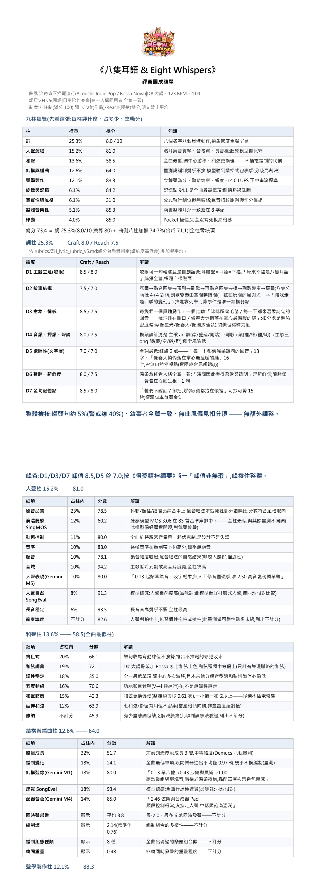

# 歌曲評審團(song-jury)

[](https://github.com/vava2684/song-jury/actions/workflows/ci.yml)

> 🎧 **免安裝線上試用**:**https://meowfullhouse.com** → 點「免費歌曲評審團」,貼 SUNO 連結即評。
> 想自架 / 進階功能(PK、抽卡比較)看以下。

一套本機跑的 **AI 歌曲評測系統**。不需要參考原曲,從九個主題角度給出可辯護的診斷 ——
**它替評審完成 80% 的細部研究,最後 20% 的判斷永遠屬於人。**

**為什麼可信**:這套系統的每一個權重、每一次除名、每一條凍結,都出自**十三個不同模型家族的正式辯論程序**
(Anthropic / OpenAI / Google / xAI / DeepSeek / 阿里 / Moonshot / MiniMax / Mistral / NVIDIA / Meta / 百度 / 騰訊),
有票數、有判準、有紀錄 —— 完整沿革見 [`docs/權重沿革.md`](docs/權重沿革.md)。
分數是**診斷分**:同標準下排序、定位問題用,不自稱客觀真理。**終審是聽眾。**

---

## 九柱制(滿分 100)

```
總分 = 25.3%×詞柱 + 74.7%×曲側八柱
```

| 柱 | 權重 | 評什麼 | 誰在評 |
|---|:--:|---|---|
| ✍️ **詞** | 25.3% | 歌詞(中/英/日/韓四把語言尺,作品分/爆款分雙分) | 對話中的 AI 依尺執行 |
| 🎤 **人聲演唱** | 15.2% | 唱得好不好 | 演唱量測 + SingMOS 聽感 + 兩隻模型耳 |
| 🎼 **和聲** | 13.6% | 和弦寫作:終止式/和弦詞彙/調性/五度動線/延伸和弦 | Viterbi 和弦辨識 |
| 🏗 **結構與編曲** | 12.6% | 能量成長、編制變化、結構弧線、配器 | Demucs 六軌 + 模型耳 |
| 🔊 **聲學製作** | 12.1% | 混音品質:頻譜/立體聲/諧波/動態 LRA | EBU R128 量測 + Audiobox |
| 🎵 **旋律與記憶** | 6.1% | 旋律好不好記 | Gemini + SongEval |
| 🌍 **真實性與風格** | 6.1% | 離真實專業音樂多遠、曲風有無新意 | MuQ 嵌入距離 + Gemini |
| 🧭 **整體音樂性** | 5.1% | 聽完整首的總體感 | Gemini + SongEval |
| 🥁 **律動** | 4.0% | 節奏活不活 | Gemini |

**柱外三種項目**(照列不計分,誠實攤開):
**顯示軸**(AI 感偵測、編曲細部、Reach 訊號)、**體檢**(響度/削波,異常才出聲)、
**❄ 凍結**(可靠性驗證未過的量測,分數照列標 ❄ 不計入)。

> **為什麼按主題分柱而不按模型分**:同一個主題裡,**量測給數字、模型給耳朵,互為證據鏈**。
> 兩邊吵架時報告會攤開讓評審自己判 —— 這正是它想被使用的方式。

---

## 三種輸入 · 三種模式

| 輸入 | 說明 |
|---|---|
| **SUNO 連結**(`suno.com/song/…` 或 `/s/`) | 自動下載歌 + 抓歌名/歌詞 |
| **YouTube 連結** | 自動下載歌(需 yt-dlp+ffmpeg);抓不到詞請另給 |
| **本機檔案** | 音檔路徑 + 歌詞(貼文字或 `.txt`) |

- **單評** — 只評一首,不與他歌比較
- **PK** — 多首並排排名(統計並列 + 分項擂台 + 雷達圖 + 場景切換);⛔ 僅限同語種
- **重複抽卡比較** — 同一份詞+prompt 的多個 take 並排:該留哪一個、這套穩不穩

---

## 安裝

### 完全不懂電腦的話:雙擊一個檔就好

**先把專案抓下來**,兩種都可以:

- **不會用 git** → 在本頁按綠色的 **Code → Download ZIP**,解開就好(解出來的資料夾叫
  `song-jury-master`,可以自己改名)。**功能完全一樣** —— 程式不依賴 git,
  換行也已經處理好(`.sh` 是 LF、`.bat` 是 CRLF,有測試在守)。
- **會用 git** → `git clone https://github.com/vava2684/song-jury.git`
  (好處:之後 `git pull` 就能更新;另外 `tests/` 裡有 8 條打包自足性檢查需要 git,
  ZIP 版會誠實跳過並告訴你原因。)

**然後**:
**Windows** —— 雙擊 **`一鍵安裝.bat`**。
**Linux / macOS** —— 開終端機,`bash install.sh`。

> 💡 Windows 想直接用命令列跑的話,要帶 `-ExecutionPolicy Bypass`:
> ```powershell
> pwsh -NoProfile -ExecutionPolicy Bypass -File .\install.ps1
> ```
> 沒帶的話多數機器會被「未簽署腳本」擋下來(這個參數只影響這一次執行,
> 不會改動你系統的永久設定)。雙擊 `一鍵安裝.bat` 已經幫你帶好了。

它會自己做完這些,**中間任何一步失敗都不會中斷**,最後一次告訴你哪裡沒成功:

```
[ 1/10] 檢查並補齊基本工具(uv / git / ffmpeg)  ← 沒有就用 winget / brew / apt 幫你裝
[ 2/10] Gemini 金鑰               ← ⭐ 全程唯一要你動手的一步,問完就能放著不管
[ 3/10] 建立量測環境 .venv
[ 4/10] 建立模型環境 .venv-ml(SongEval + Audiobox)
[ 5/10] 取得 SongEval 原始碼
[ 6/10] 鎖回 torch 版本
[ 7/10] 建立分軌環境 .venv-demucs
[ 8/10] 建立新耳朵環境 .venv-audition
[ 9/10] 情緒詞典
[10/10] 自我檢查 —— 實際確認九根柱子哪些可用(含真打一次 Google API 驗金鑰)
```

> **金鑰為什麼排在最前面**:它是全程唯一需要你回答的問題。
> 放在後面的話,你去泡茶回來會發現安裝卡在那裡等輸入了半小時 —— 這是實測踩到才改的。

### 🔑 Gemini 金鑰是必要的,不是可選

**律動柱(4%)100% 靠 Gemini**,沒有金鑰那根柱子整根評不出來 →
依九柱制的定義,你的機器就**評不出有效分數**(另外還有結構/旋律/人聲/整體/曲風各缺一項)。

[**免費申請**](https://aistudio.google.com/apikey)(Google 帳號登入就能拿,免費額度個人用足夠)。
安裝時直接貼上即可;先跳過的話,之後把 `.env.example` 複製成 `.env`、
填 `GEMINI_API_KEYS=你的金鑰`,再跑一次 `-CheckOnly` 確認。

### 🎛 ffmpeg 也是必要的,不是可選

Gemini 聽歌走 API 內嵌上傳,上限約 20MB(base64 後)——**一般 WAV
(4 分鐘 PCM ≈ 40MB)必超限**,要靠 ffmpeg 自動轉 320k mp3 才進得去。
沒有 ffmpeg 的機器評 WAV 時,Gemini 餵的六個柱項會整批缺席 → 不算完整安裝,
安裝腳本會以紅字擋下並 exit 1。安裝腳本會自動幫你裝(winget / brew / apt);
自動裝失敗就手動裝好加入 PATH,再跑一次 `-CheckOnly`。

> 📁 順帶一提:工作鎖與 Gemini 冷卻狀態放在**使用者全域目錄**
> (Windows:`%LOCALAPPDATA%\song-jury`;Linux/macOS:`~/.local/state/song-jury`),
> 不在工具資料夾裡 —— **同一位 OS 使用者**存幾份副本,互斥與金鑰冷卻都是共用的。
> ⚠️ 誠實邊界:不同 OS 帳號(例如登入使用者 vs 排程服務)或不同機器,
> 同時評同一個共享音檔仍會互踩中間檔,不要那樣用。
> 裡面只有 0 byte 的鎖檔與一個小 JSON,可放心無視。

最後印出來的長這樣 —— **它不會只說「安裝成功」,而是逐柱告訴你能不能算分**:

```
      柱             權重    狀態
      ────────────────────────────────────────────────────────
      詞            25.3%   完整
      人聲演唱      15.2%   部分 —— 缺 SingMOS 聽感
      和聲          13.6%   完整
      結構與編曲    12.6%   缺項(整柱不計)
      ...
      ⛔ 安裝不完整 —— 有 12.6% 的權重整根缺席,這台機器目前【評不出有效分數】。
```

### ⛔ 要裝就要全部裝齊

**九柱制的滿分定義是「九根柱子都在」。少一根就是換了一把尺** ——
程式仍會把剩下的柱重新歸一化算出一個數字,但那個數字**不可與別人互比、不可拿去排行、
不可當作品的評測結果**。所以報告與 JSON 都會被打上「⛔ 不完整評測」的標記,不會讓它偽裝成正常分數。

裝到一半斷線很正常(要下載好幾 GB)。**直接重跑同一個安裝檔**,已經裝好的不會重裝,
補到自我檢查印出「✅ 九柱齊全、細項無缺」為止。
事後想再確認一次:`./install.ps1 -CheckOnly` 或 `bash install.sh --check-only`(什麼都不會裝)。
要「連模型下載/載入/推論都來真的」的完整證明:`./install.ps1 -VerifyModels` 或
`bash install.sh --verify-models` —— 它會用一個唯一檔名實跑一遍九柱(強迫每個模型
真的推論一次,首次會下載數 GB,很久),再用 `驗證報告.py` 獨立拆 JSON 驗完整性。

**安裝器的退出碼(三態,自動化請照這個判)**:

| 碼 | 意思 | 該怎麼辦 |
|:--:|---|---|
| **0** | 九柱齊全、金鑰**驗證通過**、冒煙測試過 | 可以開始評分 |
| **1** | 有步驟失敗、缺柱、缺 ffmpeg,或 `-VerifyModels` 沒過 | 看上面的紅字補齊後重跑 |
| **3** | 元件都齊,但**金鑰有效性未能驗證**(全部限流中 / 網路 / TLS) | 不是壞掉,但也還不能宣稱可用;恢復後重跑 `-CheckOnly` |

(`評審團.py` 自己另有一套:**0=完整評測、2=報告已發布但缺柱、其他=失敗**。)

其他開關(⚠️ **都不是評測用的**,只給「先確認機器跑得動」用):
`-SkipML` / `--skip-ml` 只裝量測+報告 —— 這樣裝**評不出有效分數**,測完請補齊;
`-NoAutoTools` / `--no-auto-tools` 不要自動幫你裝系統工具。

### 裡面到底裝了什麼

需要 **Python 3.11**;GPU 建議 ≥16GB VRAM(沒有 GPU 也能跑,只是慢)。
**四個環境各司其職**(版本互相衝突,不能合併 —— 這是實測結論;uv 會從快取硬連結同版 torch,不會真的下載四次):

| 環境 | 裝什麼 | 沒有它會缺 |
|---|---|---|
| `.venv` | 量測(librosa / pyloudnorm / parselmouth)+ 報告 | 幾乎全部 |
| `.venv-ml` | SongEval + Audiobox | 五個模型聽感細項 |
| `.venv-demucs` | Demucs 六軌分離 | **結構編曲柱 + 和聲柱(合計 26.2%)** |
| `.venv-audition` | SingMOS + MuQ + SONICS | 人聲柱的 SingMOS、真實風格柱 |

> 已經有 demucs 的人(例如裝在 anaconda 裡),設環境變數 `SONG_JURY_DEMUCS_PY` 指過去,
> 安裝腳本就會跳過 `.venv-demucs`。

**要自行取得**(授權因素不隨本 repo 散布,安裝腳本會處理或提示):
- **SongEval**(CC BY-NC-SA,非商用)→ 腳本自動 clone
- **Meta Audiobox Aesthetics** → 腳本自動裝
- **NRC-VAD 情緒詞典**(禁再散布)→ 腳本自官方源代取
- **Gemini API 金鑰** → 安裝時直接問你,或事後填 `.env`([免費申請](https://aistudio.google.com/apikey))
- **SONICS checkpoint**(可選,只影響「AI 感」這條**不計分**的顯示軸)→
  自 [awsaf49/sonics](https://github.com/awsaf49/sonics) 取 `sonics-alpha-120s`,
  放到 `ckpt/sonics-alpha-120s/`(或設環境變數 `SONG_JURY_SONICS_CKPT` 指過去)。
  沒有它一切照常,報告只是不顯示 AI 感那一列。

> ⛔ **品質至上・排隊不降級**:Gemini 曲評固定用最好的模型;它故障時報告誠實標「缺席待補」,
> **不換次級模型頂替** —— 儀器版本混用會破壞可比性。等它恢復後重評即可補齊。

---

## 用法

> ⚠️ **一定要用 `.venv` 裡的 python**,不能打裸 `python` —— 所有相依都裝在 `.venv`,
> 用系統 python 會 `ModuleNotFoundError`。下面每一行都已經寫成正確形式。

```bash
# Windows(PowerShell)
.venv\Scripts\python.exe 評審團.py "<SUNO/YouTube 連結 或 音檔路徑>"   # 九柱音訊評測 → 歌名_評審團.json
.venv\Scripts\python.exe 情感弧線.py 歌詞.txt                          # 情感弧線圖 → _情感弧線.png
.venv\Scripts\python.exe 報告轉PDF.py 報告.md                          # 報告 md → PDF
.venv\Scripts\python.exe 轉PNG.py    報告.pdf                          # PDF → 全長 PNG
```

```bash
# Linux / macOS
.venv/bin/python 評審團.py "<SUNO/YouTube 連結 或 音檔路徑>"
.venv/bin/python 情感弧線.py 歌詞.txt
.venv/bin/python 報告轉PDF.py 報告.md
.venv/bin/python 轉PNG.py    報告.pdf
```

**詞柱**不是程式跑的:把歌詞交給對話中的 AI,說「依評詞標準評詞」—— AI 讀 `評詞標準.md` 與
`rubrics/` 底下對應語言的尺照辦。

`評審團.py` 負責「評一首歌的曲側八柱」;PK / 抽卡比較由 AI 編排(跑多首 + 綜合),不是程式職責。

### 本機網頁版(可選,免打指令)

```bash
./run_web.ps1        # Windows
bash run_web.sh      # Linux / macOS
```

網頁版的詞柱需要 [Ollama](https://ollama.com)(本機免費離線 AI):`ollama pull qwen3`。
曲側八柱不裝 Ollama 也能跑。

---

## 範例報告(真的跑出來的,不是示意圖)

《**八隻耳語 & Eight Whispers**》— VAVA_Ai_Artist ·
🎧 **[聽這首歌](https://song.link/s/03EG6lXqCYzVR5WPSUfLdF)**(Spotify / Tidal / Pandora 等)



📄 **[看完整報告(五頁全長圖)](assets/範例報告_八隻耳語.png)**

報告的骨架是**兩層**:先一張**九柱總覽**(每柱評什麼、占多少、拿幾分、一句話),
再**逐柱攤開細項**(細項 | 占柱內 % | 分數 | 解讀)。三條硬規矩:

- ⛔ **沒有解讀的分數 = 黑盒,不准出報告** —— 每個數字右邊都要有一句人話。
- ⛔ **解讀主文寫這首歌這一項的具體狀態**(帶實測值),定義與免責放括號擺句尾;
  「色彩多元」這種放到別首歌也成立的話 = 不合格。
- ⛔ **不腦補因果** —— 沒有數據支持的「因為…所以…」一律刪掉。

報告最後還有**名詞小註**(給第一次讀的人)、**親聽檢查清單**(人耳要去確認什麼)、
**合議庭裁決**(把量測與模型吵架的地方攤開,裁量權留給人)。

### 🎵 四語範例歌曲(`examples/`)

repo 附四首**作者自己的 SUNO 作品**(同意公開散布),中/英/日/韓各一、都帶歌詞 —— 裝完立刻就能試,四把語言尺各有一首可以對照:

| 語言 | 歌 | 檔案 |
|---|---|---|
| 中文 | 貓步友情進行式 | `examples/中文範例-*.mp3` + 歌詞 `.txt` |
| 英文 | Wings Unfolded(展開翅膀) | `examples/英文範例-*.mp3` + 歌詞 `.txt` |
| 日文 | 心を守って離れなくて(守護著心不願離開) | `examples/日文範例-*.mp3` + 歌詞 `.txt` |
| 韓文 | 구르기의 다정해(球球的黏人時刻) | `examples/韓文範例-*.mp3` + 歌詞 `.txt` |

```bash
# 曲側八柱(Windows;Linux/macOS 換成 .venv/bin/python)
.venv\Scripts\python.exe 評審團.py "examples\中文範例-貓步友情進行式.mp3"
```

**詞柱**:把同名 `.txt` 裡的歌詞交給對話中的 AI,說「依評詞標準評詞」。
(txt 內含 SUNO 段落標記 `[Verse …]`,那是編曲指令不是歌詞,評詞時 AI 會自行略過。)

> ⚠️ 誠實註記:範例檔是 SUNO 直出的 mp3,實測平均 **177–183 kbps VBR**
> (`ffprobe` 量的,四首分別 183.4 / 178.4 / 177.8 / 177.0)。
> 這是一般串流品質,不是刻意壓過的低碼率檔;拿它們評出來的聲學柱分數
> 反映的是「這個檔本身」,想比較不同編碼的影響請自己另外轉檔。
> (前一版這裡寫的位元率是沒實測就寫上去的,已用 `ffprobe` 更正 —— 現在有測試釘住它。)

---

## 詞柱:四把語言尺

歌詞語言決定用哪把尺(判定順序 **韓 → 日 → 中 → 英**;日文含漢字須排在中文前):

| 語言 | 尺 | 維度數 |
|---|---|:--:|
| 中文(國/粵/台/客) | `rubrics/ZH_lyric_rubric_v5.md` | 7 |
| 英文 | `rubrics/EN_lyric_rubric_v2.md` | 6 |
| 日文 | `rubrics/JA_lyric_rubric_v3.md` | 6 |
| 韓文 | `rubrics/KO_lyric_rubric_v4.md` | 7 |

⛔ **四把尺絕不混讀** —— 它們的軸互斥(韓文尺明文廢掉日文的音高重音與中文的倒字)。
⛔ **跨語言 PK 禁止** —— 維度數與軸不可共量。

**Craft / Reach 雙分**:「寫得好不好」與「傳不傳得開」分開給,**明文禁止平均**。
一首歌可能作品分高、爆款分低(藝術性強但小眾),或反過來。

**情感框架**(AI 沒有感受,評情感只准交證據,禁「我覺得很感人」):
中文尺走情感三支柱(客觀對應物 / 張力管理 / 情感弧線儀)、英日韓尺各有對應框架。

**題材選尺**:嘻哈看多押內韻、民謠白描不算說教、古風文雅凝練(口語反而扣分)、
搖滾態度宣言是慣例不扣、洗腦向疊詞是本體 —— 防曲風偏見。

四把尺各經**八家模型五輪對抗審查**定版;理論靠山、判準與誠實條款寫在各尺內。

---

## 曲側:得獎精神綱要

曲側的解讀框架來自 [`得獎精神綱要.md`](得獎精神綱要.md) —— 從 54 首金曲/葛萊美/KMA 得獎作的
證據型曲評卷宗蒸餾而成:三條總綱(**峰值非無瑕** / **對比=高級感** / **道地是底線、驚喜是加冕**)
+ 六維條文(層次是戲劇設計、Hook 是設計出來的償付、Pocket 是生死線……)。

⛔ 它是**參照系不是統計門檻** —— 得獎代表那個時代評委的精神與趨勢,不是聲學絕對值。

---

## 測試

```bash
pip install -r requirements-dev.txt
python -m pytest tests -q          # 224 條(約 45 秒;含真子程序樹與安裝器順序的行為測試)
python tests/變異驗證.py            # 證明測試不是裝飾品
```

**測試刻意不需要那四個重量級環境**(torch / demucs / SongEval 合計十幾 GB)——
只要 `pytest + numpy` 就跑得完。因為這個專案出過的 bug 幾乎全部都在**接線與邏輯**上,
不在模型推論裡:打包漏檔、取值鍵名寫錯、快取撞名、分數沒夾範圍、缺柱被當成正常分數、
失敗時偷用舊報告。每一條測試都對應一個**真的發生過**的事故。

### 變異驗證:憑什麼相信這些測試有用

`tests/變異驗證.py` 會把每個已修好的缺陷**塞回程式裡**,跑對應的測試,確認它真的失敗,再還原:

```
[1/99] ✅ 抓到了:切窗漏掉最後一個完整窗(40s 只分析 1 個窗)
[2/99] ✅ 抓到了:Gemini 分數不夾範圍(M1:99 → 990/100)
[3/99] ✅ 抓到了:Gemini 總分取錯鍵名(整關被靜默丟掉)
[4/99] ✅ 抓到了:快取不驗身分(同名不同曲會讀到別首歌的分軌)
...
  ✅ 99 條真實缺陷全部會被測試抓到
```

⛔ **一條測試若在缺陷被塞回去之後仍然通過,那條測試就是裝飾品。**
第一次跑這支的時候,它就抓出我自己有兩條測試是裝飾品 —— 這正是它存在的理由。
CI 會獨立跑它,讓「測試有沒有效」本身也被自動檢查。

---

## 誠實條款

- **不是客觀真理**,是可辯護的診斷判斷;讀差距,別讀絕對值。
- **SongEval / Audiobox 有品味傾向**:實測它們給 AI 生成音樂的分**高於**專業得獎作品
  (對照實驗已排除音檔品質因素)→ 這兩具只可**同類池內相對比較**,不當絕對品質讀,報告會標註。
- **詞曲咬合目前無可靠儀器**(候選未過判別考,誠實空缺)。
- **情感弧線儀絕對值不可信**(詞庫盲於反諷),只看段落間相對移動。
- **SUNO 連結評的是未後製原始版**,與後製成品不可互比。
- **終審是聽眾** —— 發佈後的完播、分享、被引用的句子,勝過本標準的一切判定。

---

## 雙層架構(開源憲法)

本專案只出「**通用層**」—— 中立標準 + 工具。
**任何特定使用者的個人東西**(錨點判例、市場偏好、產線策略)**都不進 repo**;
錨點庫出廠為空,每個使用者用自己的裁決養自己的尺,對所有人客觀中立。

---

## 檔案說明

| 檔案 | 用途 |
|---|---|
| `評審團.py` | 九柱整合器(輸入處理 → 各引擎 → `pillar_totals` 組裝) |
| `song_scorer.py` | 物理量測(響度/動態/頻譜/立體聲/削波)+ 演唱量測 |
| `和聲分析.py` | 和弦辨識(chroma + Viterbi) |
| `編曲層次.py` | Demucs 六軌分離 + 編曲量測 |
| `Gemini曲評.py` | 六維證據型曲評(聽真音檔、引時間碼) |
| `演唱聽感.py` | SingMOS 歌唱 MOS(吃 Demucs 人聲軌) |
| `真實距離.py` | MuQ 嵌入 → 距真實音樂分佈的馬氏距離 + SONICS AI 感 |
| `情感弧線.py` | 歌詞情緒弧線儀(NRC-VAD) |
| `顯示規則.py` | 決定哪些指標該印、哪些該閉嘴(有實測出處) |
| `批次評測.py` | 多首批次 + 鑑別力報告 |
| `報告轉PDF.py` / `轉PNG.py` | 報告 md → PDF → 長圖 |
| `評詞標準.md` | 詞柱與報告格式的唯一真理來源 |
| `得獎精神綱要.md` | 曲側解讀框架 |
| `全評測內容總清單.md` | 每一項評測內容的完整帳目(含不計分項) |
| `親聽檢查清單.md` | 人耳終檢功課單 |
| `_錨參照/` | 距離錨與 MOS 基準(衍生統計,非音檔) |
| `docs/權重沿革.md` | 九柱制怎麼辯出來的(對外版) |

---

## 🙏 特別感謝 —— 最初一起參與測試的創作者

這套系統的雛形,是靠這幾位朋友無私提供作品、陪著一首首打磨出來的。也邀你逛逛他們的頻道 🎵

| 創作者 | 頻道 |
|---|---|
| Xiaoloulou | https://www.youtube.com/channel/UCtL7XFPgWzknUlW38ilBrQg |
| 渡紅塵 | https://www.youtube.com/channel/UCJ1ZgAzaMJkOYL84-XRBHhg |
| 兔子揚 | https://www.youtube.com/@yankey8440/videos |
| 九黎月 | https://www.youtube.com/@Jiuliyue |
| 墨韻音穀 | https://www.youtube.com/@%E5%A2%A8%E9%9F%BB%E9%9F%B3%E7%A9%80 |
| 苏砚Suyan | https://www.youtube.com/@suyan_66 |
| 迷路的宇宙人 | https://www.youtube.com/channel/UCdgoj5KsyZVDQt0Z1_ONz-g |
| 璃煙 | https://www.youtube.com/@LiYan_Studio |

**同時感謝這些開源專案**,沒有它們就沒有這套系統:
[SongEval](https://github.com/ASLP-lab/SongEval)(西工大 ASLP 實驗室)·
[Audiobox Aesthetics](https://github.com/facebookresearch/audiobox-aesthetics)(Meta)·
[Demucs](https://github.com/adefossez/demucs)(Meta)·
[SingMOS](https://github.com/South-Twilight/SingMOS)·
[MuQ](https://github.com/tencent-ailab/MuQ)(騰訊 AI Lab)·
[SONICS](https://github.com/awsaf49/sonics)·
[NRC-VAD](https://saifmohammad.com/WebPages/nrc-vad.html)(加拿大國家研究院)·
[librosa](https://librosa.org) · [pyloudnorm](https://github.com/csteinmetz1/pyloudnorm) · [parselmouth](https://parselmouth.readthedocs.io)

---

## 授權

**MIT License** · © 2026 vava2684

第二關模型(SongEval CC BY-NC-SA、NRC-VAD 禁再散布)各依其原授權,使用者自取,不含於本 repo。
